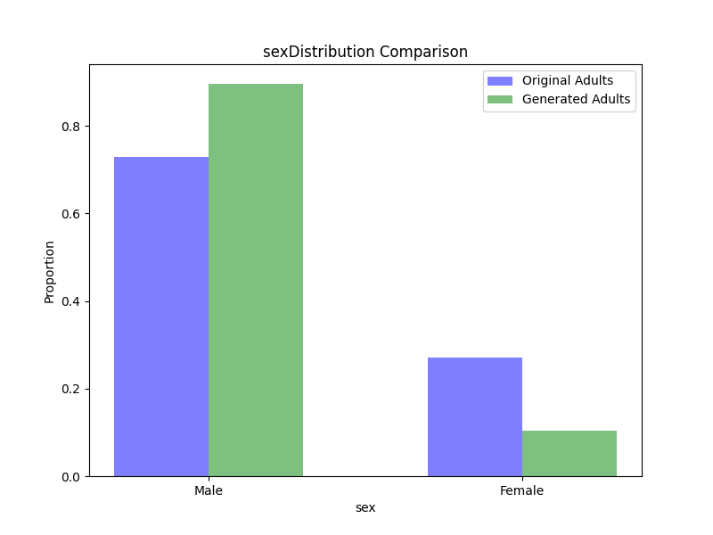

# Privately_Fine_Tune_Distill_GPT2

This is a PhD take-home assignment that involves fine-tuning DistilGPT-2 using adult100.csv (`./data/adult100.csv`) with differential privacy. In this assignment, I utilize the Hugging Face library and incorporate work I collaborated on with Jie Fu at the Shanghai Key Laboratory of Trustworthy Computing to construct a differential privacy (DP) module—without relying on Opacus or dp-transformers.

To reproduce this experiment, you can:

1. Install the required packages using:

   pip install -r requirements.txt

2. Use `csv2txt` to convert `adult100.csv` into text format, which should generate `processed_data.txt`.

3. Run `DPFineTuneGPT2.py` and modify the parameters if needed, or run `FineTuneGPT2.py` if you prefer fine-tuning without differential privacy.

4. Use `generate_synthetic_data.py` to generate a new text file containing information similar to `adult100.csv`. The file should be stored as `synthetic_data_dp.txt` if fine-tuned with differential privacy or `synthetic_data.txt` if fine-tuned without differential privacy. The generation process may take some time.

5. Run `txt2csv.py`, which should output `generated_adult100_dp.csv` if fine-tuned with differential privacy or `generated_adult100.csv` if fine-tuned without differential privacy. The output file will be stored in the `./data` directory.

6. Run `comparison.py` to obtain 1-way-marginal and 2-way-marginal distributions by comparing `adult100.csv` with the newly generated CSV file.

I implemented the entire project on my own machine with an RTX 4090 and Intel i9-13900KS. The differentially private fine-tuning process is expected to take around 10 minute with 500 epochs/iterations.

Some comparison distributions are listed below:

1-Way Marginal Distributions:

2-Way Marginal Distributions:

